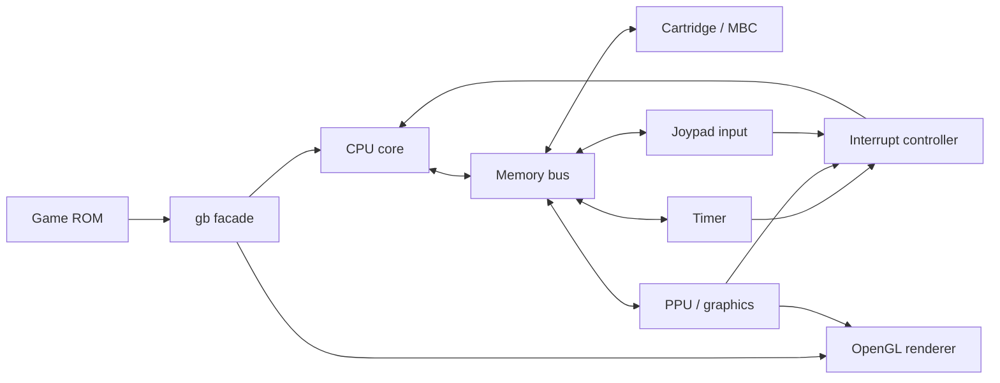

<div align="center">


<p>
  
  
  
  
</p>

<h3>A small, low-level Game Boy emulator built to understand how the DMG works from the inside.</h3>

<p>
  <a href="#-status">Status</a> •
  <a href="#-architecture">Architecture</a> •
  <a href="#-build--run">Build & Run</a> •
  <a href="#-roadmap">Roadmap</a> •
  <a href="#-resources">Resources</a>
</p>

</div>

---

## 🕹️ About

**LMGB** is a personal Game Boy emulator project written in **C++20**.  
The goal is not only to run `.gb` games, but also to deeply understand how the original Game Boy hardware works: CPU execution, memory mapping, cartridge banking, interrupts, timers, PPU timing, and rendering.

> **The project is still under active development.**  
> Some subsystems are already implemented or prototyped, while the graphics pipeline and hardware-accurate synchronization are still being actively refactored.

This repository is a learning-first emulator: the code is intentionally close to the hardware model, with separate modules for the CPU, memory, cartridge controllers, graphics, renderer, timer, interrupts, and input.

---

## 📌 Status

| Subsystem | Status | Notes |
|---|---:|---|
| CPU | 🟡 Implemented baseline | Core execution structure is present; accuracy validation is ongoing. |
| Memory bus | 🟡 In progress | Cartridge regions are routed through MBC logic; full memory map is still evolving. |
| MBC | 🟡 Partial | ROM-only and MBC1-related code exists. More cartridge types are planned later. |
| Timer | 🟡 Prototype | Basic timer registers and stepping logic are present. |
| Interrupts | 🟡 Prototype | Interrupt request/dispatch structure exists and needs tighter integration. |
| PPU / graphics | 🔴 Active refactor | Tile data, tile maps, OAM, LCD modes, palettes, DMA, and render pipeline are being rebuilt. |
| Renderer | 🟡 Prototype | OpenGL/GLFW window and texture path are implemented. |
| Input | 🟡 Early prototype | Button representation exists; full memory-mapped IO behavior is pending. |

Legend: 🟢 stable enough · 🟡 implemented/prototype · 🔴 in active development

---

## 🧱 Architecture



The project is split into small hardware-inspired components:

| Module | Responsibility |
|---|---|
| `cpu` | CPU registers, opcode stepping, stack operations, execution state. |
| `mem` | Memory access layer and routing to cartridge / hardware components. |
| `mbc`, `mbc1`, `mbc_nombc` | Cartridge memory banking logic. |
| `graphics` | PPU data structures: LCD registers, OAM, tile data, tile maps, palettes, scanline state. |
| `renderer` | GLFW/OpenGL window creation and frame presentation. |
| `timer` | DIV/TIMA/TMA/TAC timer behavior prototype. |
| `interrupts` | Interrupt flags, requests, and CPU interrupt dispatch. |
| `input` | Joypad button state model. |

---

## 🗂️ Project layout

```text
lmgb/
├── include/          # Public project headers
├── src/              # Emulator implementation
├── shaders/          # OpenGL shader programs
├── deps/             # Git submodules: GLFW, GLM, lmshader
├── docs/             # Hardware reference documents
├── CMakeLists.txt    # Build configuration
└── readme.md         # Project documentation
```

---

## 🛠️ Tech stack

<p>
  
  
  
  
  
  
</p>

Core technologies:

- **C++20** for emulator logic.
- **CMake** for project generation and builds.
- **GLFW** for window/context creation.
- **GLAD** for OpenGL function loading.
- **GLM** for math utilities.
- **OpenGL** for presenting the emulator framebuffer.

---

## 🚀 Build & Run

### 1. Clone the repository

```bash
git clone --recurse-submodules git@github.com:gammbol/lmgb.git
cd lmgb
```

If the repository was cloned without submodules:

```bash
git submodule update --init --recursive
```

### 2. Configure

```bash
cmake -S . -B build
```

### 3. Build

```bash
cmake --build build
```

### 4. Run

```bash
./build/lmgb path/to/game.gb
```

On Windows, depending on the selected CMake generator, the executable may be placed in a configuration subdirectory:

```powershell
.\build\Debug\lmgb.exe path\to\game.gb
```

> ROM files are not included in this repository. Use only legally dumped ROMs that you are allowed to run.

---

## 🧭 Roadmap

- [x] Create the basic project structure.
- [x] Implement the CPU execution foundation.
- [x] Add cartridge and MBC abstraction.
- [x] Add ROM-only / MBC1-oriented memory controller code.
- [x] Add renderer prototype with GLFW/OpenGL.
- [ ] Complete the memory map and IO register routing.
- [x] Finish PPU mode timing and scanline rendering.
- [x] Implement background/window rendering.
- [x] Implement object/sprite rendering.
- [ ] Implement OAM DMA cleanly through the memory bus.
- [ ] Integrate timer, interrupts, input, CPU, and PPU timing.
- [ ] Add test ROM based validation.
- [ ] Add save RAM support.
- [ ] Add audio/APU support.
- [ ] Improve debugging tools and developer diagnostics.

---

## 📚 Resources

Useful Game Boy development and emulation references:

- [Pan Docs](https://gbdev.io/pandocs/) — the main Game Boy hardware reference.
- [RGBDS gbz80 manual](https://rgbds.gbdev.io/docs/v0.9.0/gbz80.7) — CPU instruction reference.
- [gb-opcodes](https://meganesu.github.io/generate-gb-opcodes/) — visual opcode table.
- [Gekkio Game Boy resources](https://gekkio.fi/) — hardware research and documentation.
- [Game Boy: Complete Technical Reference](https://gekkio.fi/files/gb-docs/gbctr.pdf) — detailed technical reference.

---

## 🤝 Contributing

This is currently a personal learning project, so the codebase changes quickly and some parts may be experimental.  
Suggestions, notes, references, and debugging ideas are welcome, especially around hardware accuracy, PPU timing, test ROMs, and architecture.

---

## ⚠️ Disclaimer

This project is created for educational purposes.  
It does not include copyrighted Game Boy ROMs, BIOS files, or commercial game assets.

<div align="center">

<br />


</div>
